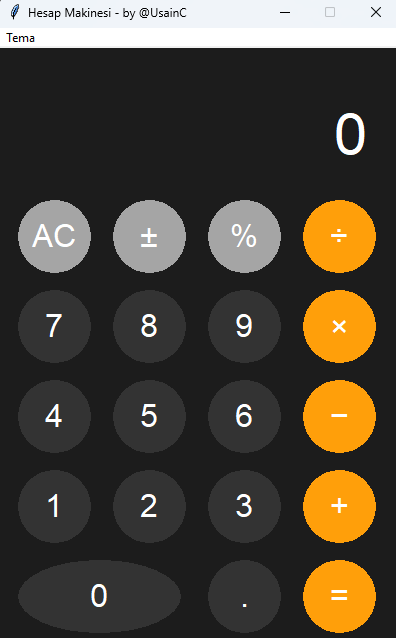

# Modern Hesap Makinesi

<p align="center">
  
</p>

## 🧮 Proje Hakkında

Bu proje, Apple'ın tasarım dilini temel alan modern ve şık bir hesap makinesi uygulamasıdır. Python ve Tkinter kullanılarak geliştirilmiş olup, kullanıcı dostu arayüzü ve çeşitli tema seçenekleriyle dikkat çekmektedir.

## ✨ Özellikler

- 🎨 5 Farklı Tema Seçeneği:
  - Koyu Tema (Dark)
  - Açık Tema (Light)
  - Mavi Tema (Blue)
  - Mor Tema (Purple)
  - Yeşil Tema (Green)
- 🔢 Temel Matematik İşlemleri
- 💫 Yuvarlak Buton Tasarımı
- 🖱️ Hover Efektleri
- ⌨️ Klavye Desteği
- 📱 Responsive Tasarım

## 🛠️ Teknolojiler

- Python 3.11
- Tkinter
- Custom Tkinter Widgets

## 🚀 Kurulum

1. Repoyu klonlayın:
```bash
git clone https://github.com/UsainC/calculator.git
```

2. Proje dizinine gidin:
```bash
cd calculator
```

3. Uygulamayı çalıştırın:
```bash
python calculator.py
```

## 💻 Kullanım

- Tema değiştirmek için üst menüden "Tema" seçeneğini kullanabilirsiniz
- Klavye ile işlem yapabilirsiniz
- Sayılar ve işlemler için butonları kullanabilirsiniz
- İşlem sonucu için '=' tuşuna basabilirsiniz

## 👨‍💻 Geliştirici

**Hüseyin ÇELİK**

[](https://github.com/UsainC)
[](https://www.linkedin.com/in/huseyincelik2/)

## 📝 Lisans

Bu proje [MIT](LICENSE) lisansı altında lisanslanmıştır.
---
[@UsainC](https://github.com/UsainC)
